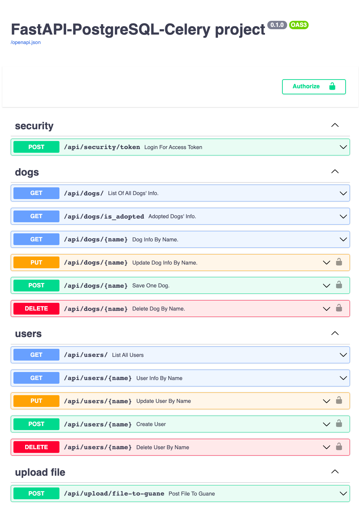

# FastAPI - PostgreSQL - Celery - Rabbitmq backend

This source code implements the following architecture:

<p align="center">
  
</p>

All the required database endpoints are implemented and tested. These include crud operations for ``dog`` and ``user`` PostgreSQL relations. The asynchronous tasks are queued via one endpoint, and the upload of files to guane internal test server (external API) is implemented as another endpoint.

This app also executes HTTP requests to another external endpoint located at <https://dog.ceo/api/breeds/image/random> which returns a message with an URL to a random dog picture. The URL is stored as the field ``picture`` in the ``dog`` relation.

## Deploy using Docker

To deploy this project using docker make sure you have cloned this repository

```bash
$ git clone https://github.com/jearistiz/guane-intern-fastapi
```

and installed Docker.

Now move to the project root directory

```bash
$ mv guane-intern-fastapi
```

Unless otherwise stated, all the commands should be executed from the project root directory denoted as ``~/``.

To run the docker images just prepare your environment variables in the ``~/.env`` file and run

```bash
$ docker compose up --build
```

If you have an older Docker version which does not support the ``$ docker compose`` command, make sure you install the ``docker-compose`` CLI, then run

```bash
$ docker-compose up --build
```

The docker-compose.yml is configured to create an image of the application named ``application/backend``, an image of PostgreSQL v13.3 –named ``postgres``–, an image of RabbitMQ v3.8 –``rabbitmq``– and an image of Redis v6.2 –``reddis``. To see the application working sound and safe, visit the URI ``0.0.0.0:8080/docs`` or the equivalent URI you defined in the ``~/.env`` file (use the format ``${BACKEND_HOST}:${BACKEND_PORT}/docs``) and start sending HTTP requests to the application via this nice interactive documentation view, brought to us automatically thanks to FastAPI integration with OpenAPI

<p align="center">
  
</p>

In order to use the POST, PUT or DELETE endpoints you should first authenticate at the top right of the application docs (``0.0.0.0:8080/docs``) in the button that reads ``Authorize``. I have set up this two super users for you to test these endpoints, use the one you feel more comfortable with ;)

```md
user: guane
password: ilovethori
```

or

```md
user: juanes
password: ilovecharliebot
```

If other fields are required in the authentication form, please leave them empty.

## Notes on the database relations

Please consider the following notes when trying to make requests to the app:

- The ``dog`` and ``user`` relations are connected by the field ``id_user`` defined in the ``dog`` relation (this is done via foreign key deifinition). Make sure the entity ``user`` with ``id = id_example`` is created before the dog with ``id_user = id_example``.
- If you want to manually define the ``id`` field in the ``user`` and ``dog`` relations, make sure there is no other entity within the relation with the same ``id``.
  - The best thing is to just let the backend define the ``id`` fields for you, so just don't include these in the HTTP request when trying to insert or update the entities via POST or PUT methods.

Thats it for deploying and manually testing the endpoints.

## Test the application inside Docker using pytest

If you want to run the tests inside the docker container, first open another terminal window and get the ``<Container ID>`` of the ``app/backend`` container using the command

```bash
$ docker ps
```

This command will list information about all your docker images but you are interested only in the one named ``app/backend``.

Afterwards, run a bash shell using this command

```bash
$ docker exec -it <Container ID> bash
```

When you are already inside the container's bash shell, make sure you are located in the ``/app``  directory (you can check this if ``$ pwd`` prints out ``/app``... if not, execute ``$ mv /app``), and execute the following command:

```bash
$ python scripts/app/run_tests.py
```

There are some options for this testing initialization script (which underneath uses ``pytest``) such as ``--cov-html`` which will generate an html report of the coverage testing. If you want to see all the options just run ``$ python scripts/app/run_tests.py --help``. And test using your own options.

## Deploy without using Docker

The application can also be deployed locally in your machine. It is a bit more dificult since we need to meet more requirements and setup some stuff first, but soon I will post more info on this here.

## References

This app was developed using as main reference [@tiangolo](https://github.com/tiangolo)'s [FastAPI documentation](https://fastapi.tiangolo.com/) and his [Full stack, modern web application generator](https://github.com/tiangolo/full-stack-fastapi-postgresql), which are both distributed under an MIT License. Some parts of this source code are literal code blocks from the cited references.
