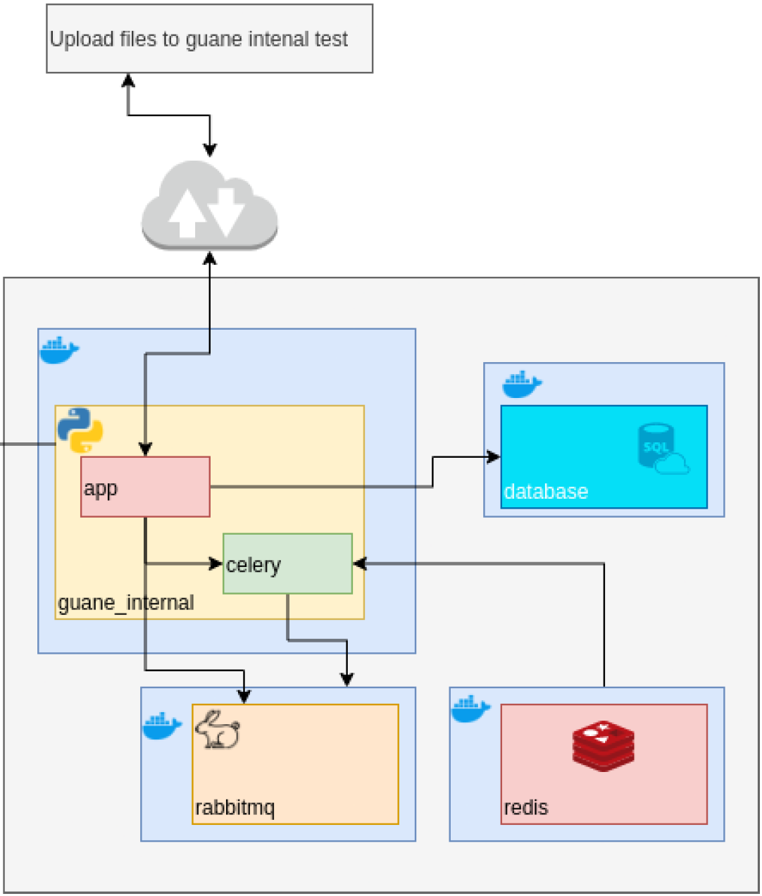

# FastAPI - PostgreSQL - Celery - Rabbitmq backend

This source code tries to implement the following architecture:

<p align="center">
  
</p>

At this point the python and database containers are dockerized as well as implemented. The missing parts are the celery-related containers and implementation.

On the other side, all the required endpoints are implemented and tested.

## Deploy using Docker

To deploy this project using docker make sure you have cloned this repository, and installed Docker.

To run the docker images just prepare your environment variables in the ``~/.env`` file and run

```bash
$ docker compose up --build
```

If you have an older Docker version which does not support the ``$ docker compose`` command, make sure you install the ``docker-compose`` CLI, then run

```bash
$ docker-compose up --build
```

At this moment the docker-compose.yml is configured to create an image of the application and an image of PostgreSQL 13. To see the app working sound and safe, visit the URI ``0.0.0.0:8080/docs`` or the equivalent URI you defined in the ``~/.env`` file given by the format ``${BACKEND_HOST}:${BACKEND_PORT}/docs`` and start sending HTTP requests to the application.

In order to use the POST, PUT or DELETE endpoints you should first authenticate at the top right of the application docs (``0.0.0.0:8080/docs``) in the button that reads ``Authenticate``. I have set up this two super users for you to test these endpoints:

```md
user: guane
password: ilovethoriai
````

or

```md
user: juanes
password: ilovecharliebot
```

If other fields are required in the authentication form, please leave them empty.

Thats it for deploying and manually testing the endpoints.

## Test the application inside Docker using pytest

If you want to run the tests inside the docker container, first open another terminal window and get the ``<Container ID>`` of the ``app/backend`` container using the command

```bash
$ docker ps
```

This command will list information about all your docker images but you are interested only in the one named ``app/backend``.

Afterwards, run a bash shell using this command

```bash
$ docker exec -it <Container ID> bash
```

When you are already inside the container, make sure you are already placed in the ``/app``  directory (you can check this with ``$ pwd``... if not, execute ``$ mv /app``), and execute the following command:

```bash
$ python scripts/app/run_tests.py
```

There are some options for this testing initialization script (which underneath uses ``pytest``) such as ``--cov-html`` which will generate an html report of the coverage testing. If you want to see all the options just run ``$ python scripts/app/run_tests.py --help``.

## References

This app was developed using as main reference [@tiangolo](https://github.com/tiangolo)'s [FastAPI documentation](https://fastapi.tiangolo.com/) and his [Full stack, modern web application generator](https://github.com/tiangolo/full-stack-fastapi-postgresql), which are both distributed under an MIT License. Some parts of this source code are literal code blocks from the cited references.
